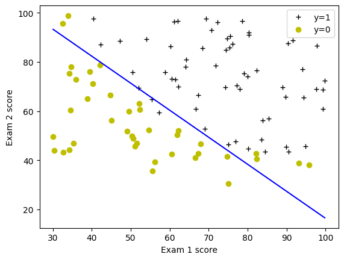
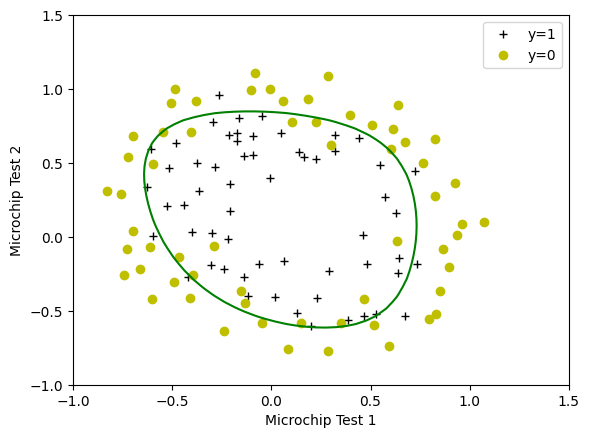

# 🧠 Logistic Regression Project

> *Predicting student admissions and microchip quality using regularized logistic regression*

[](https://www.python.org/)
[](https://numpy.org/)
[](https://matplotlib.org/)

---


## 🎯 Overview

This project implements **Logistic Regression** from scratch using NumPy, covering both **binary classification** and **regularized logistic regression**. The implementation includes:

- ✅ Sigmoid function implementation
- ✅ Cost function computation
- ✅ Gradient descent optimization
- ✅ Regularization (L2) to prevent overfitting
- ✅ Decision boundary visualization
- ✅ Model accuracy evaluation

### Two Real-World Applications:

1. **🎓 University Admissions** - Predict student admission based on exam scores
2. **🔬 Microchip Quality Control** - Classify microchips as accepted/rejected using polynomial feature mapping

---

## 📁 Project Structure

```
Logistic_Regression_Project/
│
├── C1_W3_Logistic_Regression.ipynb   # Main Jupyter notebook with all implementations
├── utils.py                           # Helper functions for visualization
├── public_tests.py                    # Unit tests for validation
├── requirements.txt
│
├── data/
│   ├── ex2data1.txt                   # Admissions dataset (Exam 1 & 2 scores)
│   └── ex2data2.txt                   # Microchip dataset (Test 1 & 2 results)
│
├── images/                            # Generated plots and decision boundaries
│
└── README.md                          # This file
```

---

## 🧪 Learning Objectives

By completing this project, you will master:

| Concept | Implementation |
|---------|----------------|
| 📐 Sigmoid Function | `1 / (1 + e^{-z})` |
| 💰 Cost Function | Binary cross-entropy loss |
| 📉 Gradient Descent | Parameter optimization |
| 🛡️ Regularization | L2 regularization to prevent overfitting |
| 📊 Feature Mapping | Polynomial expansion for non-linear boundaries |
| 📈 Model Evaluation | Accuracy metrics and decision boundary plotting |

---

## 🚀 Installation & Setup

### Prerequisites
- Python 3.8 or higher
- pip package manager

### Step-by-Step Setup

```bash
# 1. Clone the repository
git clone https://github.com/MohamedAliZouariEng/DeepLearningAiProjects.git

# 2. Navigate to the project directory
cd DeepLearningAiProjects/Machine-Learning-Specialization/Course1-Supervised-Machine-Learning-Regression-and-Classification/Logistic_Regression_Project

# 3. Create a virtual environment
python3 -m venv venv

# 4. Activate the virtual environment
# On Linux:
source venv/bin/activate
# 5. Install required packages
pip install -r requirements.txt
```

---

## 📊 Datasets

### Dataset 1: University Admissions (`ex2data1.txt`)

| Feature | Description |
|---------|-------------|
| Exam 1 Score | First exam score (0-100) |
| Exam 2 Score | Second exam score (0-100) |
| Admitted | Target: 1 = Admitted, 0 = Not admitted |

- **Samples**: 100 students
- **Task**: Binary classification based on exam performance

### Dataset 2: Microchip Quality (`ex2data2.txt`)

| Feature | Description |
|---------|-------------|
| Test 1 | First QA test result |
| Test 2 | Second QA test result |
| Accepted | Target: 1 = Accepted, 0 = Rejected |

- **Samples**: 118 microchips
- **Challenge**: Non-linear decision boundary required
- **Solution**: Feature mapping to 27 dimensions (polynomial terms up to 6th power)

---

## 🔧 Implementation Details

### Core Functions Implemented

```python
# 1. Sigmoid Function
def sigmoid(z):
    return 1 / (1 + np.exp(-z))

# 2. Cost Function
def compute_cost(X, y, w, b):
    # Binary cross-entropy loss
    loss = -y[i] * np.log(f_wb) - (1 - y[i]) * np.log(1 - f_wb)
    
# 3. Gradient Computation
def compute_gradient(X, y, w, b):
    # Derivatives for gradient descent
    dj_dw = (1/m) * Σ (f_wb - y) * x_j
    dj_db = (1/m) * Σ (f_wb - y)

# 4. Regularized Cost
def compute_cost_reg(X, y, w, b, lambda_):
    reg_cost = (lambda_/(2*m)) * Σ w_j²

# 5. Regularized Gradient
def compute_gradient_reg(X, y, w, b, lambda_):
    dj_dw = original_gradient + (lambda_/m) * w_j
```

### Regularization Parameter (λ)

| λ Value | Effect |
|---------|--------|
| λ = 0 | No regularization (risk of overfitting) |
| λ = 0.01 | Light regularization (recommended) |
| λ = 1 | Moderate regularization |
| λ = 100 | Heavy regularization (risk of underfitting) |

---

## 📈 Results

### Model 1: University Admissions

```
Train Accuracy: 92.00%
Decision Boundary: Linear
```



### Model 2: Microchip Quality Control

```
Train Accuracy: 82.20%
Decision Boundary: Non-linear (27 polynomial features)
Regularization: λ = 0.01
```



---

## 📚 References

- [Machine Learning Specialization - DeepLearning.AI](https://www.deeplearning.ai/courses/machine-learning-specialization/)
