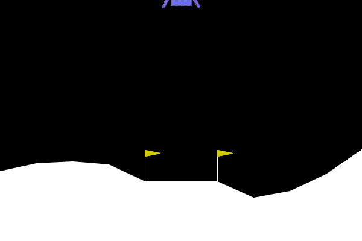

# 🌕 Deep Q-Learning - Lunar Lander

[](https://www.python.org/)
[](https://www.tensorflow.org/)
[](https://www.gymlibrary.dev/)

## 📋 Overview

This project implements a **Deep Q-Learning (DQN)** agent to solve the **Lunar Lander** environment from OpenAI Gym. The agent learns to safely land a lunar module on a landing pad using reinforcement learning techniques including **Experience Replay** and **Target Networks**.



## 🎯 Objective

Train an AI agent to successfully land a lunar lander on the moon's surface landing pad. The environment is considered **solved** when the agent achieves an average score of **200 points** over 100 consecutive episodes.

## 🎮 Environment Details

### Action Space (4 discrete actions)
| Action | Value |
|--------|-------|
| Do nothing | 0 |
| Fire right engine | 1 |
| Fire main engine | 2 |
| Fire left engine | 3 |

### Observation Space (8 variables)
- (x, y) coordinates (landing pad at 0,0)
- Linear velocities (ẋ, ẏ)
- Angle θ
- Angular velocity θ̇
- Two booleans for leg contact

### Rewards System
- +10 points per leg touching the ground
- -0.03 per frame for side engine firing
- -0.3 per frame for main engine firing
- +100 for safe landing
- -100 for crashing


## 🧠 DQN Architecture

The Deep Q-Network consists of:
- **Input layer**: State size (8)
- **Hidden layer 1**: 64 neurons (ReLU activation)
- **Hidden layer 2**: 64 neurons (ReLU activation)
- **Output layer**: 4 neurons (Linear activation for Q-values)

### Key Techniques

| Technique | Description |
|-----------|-------------|
| **Experience Replay** | Stores experiences in memory buffer to break correlations |
| **Target Network** | Separate network for stable Q-value targets |
| **Soft Updates** | τ = 0.005 for gradual target network updates |
| **ε-Greedy Policy** | Exploration-exploitation trade-off |

## 📊 Hyperparameters

| Parameter | Value | Description |
|-----------|-------|-------------|
| MEMORY_SIZE | 100,000 | Experience replay buffer size |
| GAMMA (γ) | 0.995 | Discount factor |
| ALPHA (α) | 1e-3 | Learning rate |
| NUM_STEPS_FOR_UPDATE | 4 | Update frequency |
| ε (initial) | 1.0 | Initial exploration rate |
| ε (final) | 0.01 | Minimum exploration rate |

## 🚀 Getting Started

### Prerequisites

```bash
# Clone the repository
git clone https://github.com/MohamedAliZouariEng/DeepLearningAiProjects.git
cd DeepLearningAiProjects/Machine-Learning-Specialization/Course3-Unsupervised-Learning-Recommenders-Reinforcement-Learning/Deep_Q_Learning_Project
```

### Installation

```bash
# Install system dependencies (for Linux/Ubuntu)
# Required for Lunar Lander environment rendering
sudo apt-get update
sudo apt-get install swig
sudo apt-get update
sudo apt-get install -y swig \
    libsdl2-dev \
    libsdl2-image-dev \
    libsdl2-mixer-dev \
    libsdl2-ttf-dev \
    libportmidi-dev \
    libfreetype6-dev

# Create virtual environment
python3 -m venv venv

# Activate virtual environment
# On Linux:
source venv/bin/activate
# Install Python dependencies
pip install -r requirements.txt
```

The training will:
1. Initialize the Q-Network and Target Network
2. Run episodes with ε-greedy policy
3. Store experiences in replay buffer
4. Perform gradient descent updates every C steps
5. Save the model when solved (200 average points over 100 episodes)

**Expected training time**: ~10-15 minutes with default parameters

## 📈 Results

### Training Progress
- **Episodes to solve**: ~445 episodes
- **Final average score**: 200+ points
- **Model saved**: `lunar_lander_model.h5`

### Performance Metrics

| Metric | Value |
|--------|-------|
| Success Rate | ~100% (after training) |
| Average Landing Score | >200 |
| Training Runtime | ~12 minutes |

## 🎥 Visualizing Results

The notebook includes functionality to:
- Plot training history (scores over episodes)
- Generate MP4 videos of trained agent performance
- Display real-time rendering of landings

## 🔬 Technical Implementation

### Loss Function
```python
y_targets = rewards + gamma * max_qsa * (1 - done_vals)
loss = MSE(y_targets, q_values)
```

### Network Update
- Q-Network updated via gradient descent
- Target Network updated via soft update:
  ```python
  w_target ← τ * w_q + (1 - τ) * w_target
  ```

## 📚 References

1. Mnih, V., et al. (2015). **Human-level control through deep reinforcement learning**. *Nature*, 518(7540), 529-533.

2. Lillicrap, T. P., et al. (2016). **Continuous Control with Deep Reinforcement Learning**. *ICLR*.

3. Mnih, V., et al. (2013). **Playing Atari with Deep Reinforcement Learning**. *arXiv:1312.5602*.
- [Machine Learning Specialization - DeepLearning.AI](https://www.deeplearning.ai/courses/machine-learning-specialization/)

## 📝 Key Learnings

- 🎯 Deep Q-Learning enables solving continuous state space problems
- 💾 Experience replay significantly improves training stability
- 🎲 Target networks prevent harmful feedback loops
- 🔄 Soft updates provide smoother convergence
